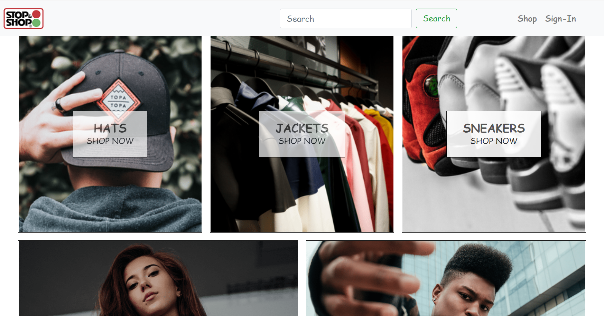

# eShopWithReact
Build e-commerce website using ASP.NET core and ReactJS based on Microservice Architecture.
Other tool stack include Docker, RabbitMQ, Ocelot API Gateway, MongoDB, Redis, SqlServer.

## Web/Shop - Frontend application built using ReactJS
State Management using Redux, Thunk, Saga, Reselect, Hooks \
Local Storage using Persist \
API Calls using Axios \
Logging using Logger

## Services
APIs build based on Onion Architecture\
Authentication using IdentityServer4



## Common Library

**Common.Core**
>Install-Package Microsoft.AspNetCore.Http.Features
>Install-Package Newtonsoft.Json

**Common.Infrastructure**
>Install-Package Microsoft.EntityFrameworkCore
>Install-Package MailKit
>Install-Package NLog
>Install-Package Microsoft.AspNetCore.Mvc.Versioning
>Install-Package Microsoft.AspNetCore.Mvc.Versioning.ApiExplorer
>Install-Package Microsoft.AspNetCore.Mvc.ApiExplorer
>Install-Package Swashbuckle.AspNetCore

#

## Product Catalog Service

**MongoDB Set-up for the Catalog Database**

` docker pull mongo `

` docker run -d --name mongodb  -p 27017:27017 -e MONGO_INITDB_ROOT_USERNAME=mongoadmin -e MONGO_INITDB_ROOT_PASSWORD=secret mongo `

```
-d                                       - runs the container in background;
--name mongodb                           - defines a friendly name for the container;
-p 27888:27017                           - declares that the local port 27888 is mapped to the internal 27017 port;
-e MONGO_INITDB_ROOT_USERNAME=mongoadmin - sets the root username (-e sets the environment variables);
-r MONGO_INITDB_ROOT_PASSWORD=secret     - sets the root password;
mongo                                    - name of the image to run;
```

` docker exec -it mongodb bash `

` mongo --host localhost -u mongoadmin -p secret --authenticationDatabase admin `


\
**ProductCatalog.Core**
>Install-Package MongoDB.Driver
>Install-Package MongoDB.Bson

**ProductCatalog.Infrastructure**
>Install-Package ServiceStack
>Install-Package Microsoft.Extensions.Configuration
>Install-Package MongoDB.Driver

**ProductCatalog.Application**
>Install-Package AutoMapper
>Install-Package Microsoft.Extensions.DependencyInjection
>Install-Package AutoMapper.Extensions.Microsoft.DependencyInjection

**ProductCatalog.Api**
>Install-Package AspNetCore.HealthChecks.MongoDb
>Install-Package NLog

**ProductCatalog.Test**
>Install-Package FluentAssertions
>Install-Package Microsoft.AspNetCore.Mvc.Testing
>Install-Package RESTFulSense

#
## User Authentication Service

**SQL Server Set-up for the User Authentication Database**
` docker pull mcr.microsoft.com/mssql/server

` docker run -e "ACCEPT_EULA=Y" -e "SA_PASSWORD=password@1234" -p 2433:1433 --name sqlserverdb -d mcr.microsoft.com/mssql/server
` docker ps -a
` docker exec -it sqlserverdb /opt/mssql-tools/bin/sqlcmd -S localhost -U sa -P "password@1234"

```
Database Setup
cmd cd D:\Projects\eShopWithReact\src\Services\UserAuthentication\UserAuthentication.Infrastructure

dotnet ef migrations add initialcreate -s ..\UserAuthentication.Api\UserAuthentication.Api.csproj

dotnet ef database update -s ..\UserAuthentication.Api\UserAuthentication.Api.csproj
```

#### Some of the commnads that you can use
```
docker exec -it sqlserverdb /opt/mssql-tools/bin/sqlcmd -S localhost -U sa -P "password1234"

DROP DATABASE AuthenticationDB
GO
CREATE DATABASE AuthenticationDB
GO
SELECT Name from sys.Databases
GO
USE AuthenticationDB
GO
SELECT * FROM AuthenticationDB.INFORMATION_SCHEMA.TABLES;
GO
EXEC sp_MSForEachTable 'SET QUOTED_IDENTIFIER ON; DELETE FROM AspNetUsers'
GO
```

**Web/Shop**

>npm install --save react-bootstrap

>npm install --save redux react-redux redux-logger redux-thunk

>npm install --save reselect

>npm install --save redux-persist

>npm install --save redux-saga

>npm install --save axios

>npm install --save react-stripe-checkout

#

